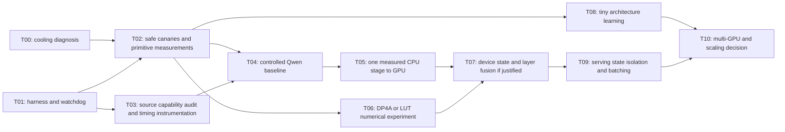

# Execution plan for Terra / Luna

Audience: a coding agent executing bounded tasks, with the user available for physical server work. Date: 2026-09-07.

## Decision

Build a small measurement and correctness foundation first. The useful Colibrì path is to profile CPU stages, move a measured expensive stage onto the P40 while preserving current arithmetic, then compare Pascal-specific arithmetic. In parallel after those primitives are measured, train tiny alternative architectures to test whether their math learns efficiently. The existing 35B checkpoint cannot simply be converted into an unrelated recurrence without training.

This handoff completes discovery and planning. It does not claim a benchmark suite, optimized server or trained architecture already exists. The long research brief is the roadmap; the user's final request makes the immediate deliverable this executable plan.

## Task graph



Only one agent may run server workloads at a time. Luna can implement report/schema/guard tests while Terra implements CUDA kernels in disjoint files; no concurrent benchmark jobs. Each task is a separate commit and experiment log entry. A handoff message contains task ID, changed paths, tests, raw result links, unresolved issues and next ID. Do not ask a small model to execute the whole roadmap in one unattended run.

## T00 — resolve cooling prerequisite (read-only discovery first)

Owner: Luna for serial telemetry; user for physical inspection if needed. Read `research/hardware.md`.

Work: sample FAN1–8, CPU/system sensors, GPU temperature and power without workload; correlate FAN2/FAN3 critical SEL events. Verify whether fan speed really oscillates or reads are erroneous. Capture sensor identity/header mapping. No guessed BMC writes or threshold suppression.

Output: `research/results/T00-thermal-investigation.md` and timestamped telemetry; pass/fail against hardware.md. A sustained-load pass needs documented resolution and five clean minutes. If unresolved, mark workload tasks `blocked_thermal`, continue T01/T03 CPU-light work, and tell the user what physical check is needed. Permission does not substitute for a passing cooling check.

## T01 — isolated workspace, manifests and guarded runner

Owner: Luna. No model or GPU workload.

Work:

1. Recheck source commit/status and binary hash. Create `/home/jordanculver/p40-native-research` on excalibur for experimental source/results. Preserve `/home/jordanculver/colibri_engine`. Pin a separate Colibrì worktree to the recorded commit, or an explicit newly inspected commit if upstream work requires it. Compile only there.
2. Implement `scripts/snapshot.py`, `guard.py`, `run_matrix.py`, `summarize.py` and result schema as specified in E001. The snapshot collects a safe environment allowlist and exact CPU/GPU/model identities. No raw user prompts, tokens or credentials beyond the public fixture.
3. Guard: one host-wide lock, independent telemetry process, child process group/cgroup, elapsed timeout, temperature/slope/fan/device-error checks, bounded TERM/KILL, restoration of any temporarily changed power limit, telemetry during post-run cooldown. Define failure statuses and a durable cleanup record.
4. Add injected telemetry tests covering rising temperature, stale polling, fan critical, subprocess failure, watchdog failure, SSH disconnect behavior, failed power restore and unrelated-process protection. These tests run without a GPU.
5. Add baseline prompt fixture and benchmark configuration; no model run yet. Templates and paths must be explicit, not inherited from shell auto-tune state.

Acceptance: CPU-only tests pass; dry-run prints argv/config and initializes no CUDA; synthetic bad telemetry prevents/terminates only its fake job; every exit reports cleanup status. No server services, toolchain versions or production files changed.

## T02 — first benchmark suite

Owner: Terra; Luna may maintain parser/report files. Dependencies: T01, and T00 for GPU execution.

Work: implement E001 P01–P10 in small increments, starting P01/P02/P03/P04. Build explicit sm61. First GPU action is device attributes plus brief correctness canaries, then bounded measurement chunks. Library unsupported cases are records, not excuses to silently replace arithmetic. Add P05/P07/P08 only after the controls are valid. Preserve random seeds and code packing fixtures.

Acceptance: CPU-reference correctness gates pass; actual DP4A SASS confirmed; warm/cold device bandwidth distinguished; complete-operator timing includes dynamic quantization; usable CSV/JSON summary and thermal records. No tokens/sec numbers invented for raw primitives. Partial coverage is explicitly listed before moving to the next task.

## T03 — family-aware source audit and phase instrumentation

Owner: Terra. Source/CPU fixture work can proceed while T00 is unresolved.

Work: build a machine-readable manifest from `research/colibri_execution.md` identifying engine-read, launcher-only, backend-reached, unsupported flags. Regression checks should catch a future change in selected family capability. In experimental source, add counters for actual CUDA launches, expert hit/miss/failed issue, per-device rows, and H2D/D2H bytes. Add optional CUDA-event timing to **`coli_cuda_expert_group_issue/take`**, since the synchronous wrapper's `COLI_CUDA_PROFILE` events are not sufficient.

Split CPU timing around DeltaNet projections/recurrence/output, attention, routing selection, shared expert, head, allocations, issue/copy/sync. Existing `COLI_TIMERS` is a starting point. Mark subset/overlap metrics to prevent double-counting. Keep one stream per device initially and test scratch lifetime/fallback with existing small fixtures. Parse timers from direct execution; served requests currently do not emit the same final report.

Acceptance: source-only tests identify generic no-op flags; instrumentation off leaves output behavior unchanged; simulated counters/parser have units and no negative durations; GPU timing works on a tiny guarded fixture once T00 passes. Inspect available `nsys`/`nvprof` help before choosing arguments; CUDA events remain the fallback.

## T04 — controlled Qwen baseline and supported setting comparisons

Owner: Terra. Dependencies: T00–T03.

Checkpoint stays `Kreuzzelg/qwen36-35b-a3b-colibri-i4` snapshot `9ccfbfa09bc55410a9c9102558ee63077d8a477d`. Changing to gs64 is a separate quality experiment, even if upstream now recommends it.

Start from the direct C engine to avoid auto-tune ambiguity. After canaries, fix a prompt, freeze token IDs, `N_NEW=512`, greedy direct generation and identical heat/cache condition. Record prompt count from the actual tokenizer. Main report uses three repetitions in alternating baseline/candidate order, median plus range; five only if stable results are inconclusive. Keep startup, loading, prefill, decode and whole elapsed time separately. Confirm exact number of forward calls; first output token follows prefill, so decode-step count can be N−1.

Proposed control, **not a measured best configuration and only under the guarded runner**:

```sh
# Run in the isolated experimental checkout, after the thermal gate.
MODEL_DIR=/mnt/ai-ssd/huggingface/hub/models--Kreuzzelg--qwen36-35b-a3b-colibri-i4/snapshots/9ccfbfa09bc55410a9c9102558ee63077d8a477d
env COLI_CUDA=1 COLI_GPUS=0,1 CUDA_EXPERT_GB=auto \
    COLI_DENSE_I8=1 COLI_TIMERS=1 \
    OMP_NUM_THREADS=24 OMP_DYNAMIC=FALSE OMP_WAIT_POLICY=PASSIVE \
    OMP_PROC_BIND=close OMP_PLACES=cores \
    Q36_MAXT=8192 PILOT=0 HOT=0 COLIBRI_RESIDENT=0 \
    SNAP="$MODEL_DIR" N_NEW=512 NOSTREAM=1 \
    ./c/qwen36 256 4 ../fixtures/prompt.txt
```

The runner must construct an allowlisted environment and explicitly unset inherited experimental flags/HEAT_FILE or supply a frozen heat fixture. The command above is the engine argv template, not an instruction to bypass guard.py. Direct text mode runs a fixed count; if served output ends on EOS, report its actual length separately. Do not treat meaningless post-EOS direct tokens as useful agent output.

Compare one axis at a time:

| Order | Change from current control | Purpose |
|---|---|---|
| 1 | OMP threads24→12, fixed allocation/binding | Oversubscription and small-operation overhead |
| 2 | NUMA default→interleave, fixed threads | Reproduce the user's OS-level NUMA hypothesis |
| 3 | Memory placement interleave→node0, same CPU binding/team | Isolate memory locality to the GPU host node |
| 4 | Bind compute to node0 physical cores at fixed 12 threads; then final combined NUMA0 placement | Separate CPU locality from memory locality |
| 5 | GPU list0,1→0, then→1 | Experts fit one card by capacity; evaluate coordination vs parallel compute |
| 6 | PASSIVE→ACTIVE wait with fixed spin count | CPU fork/join vs power/heat; keep temperature matched |
| 7 | packed W4 or dual projection default→0 separately | Verify reached kernel controls; profile reduction/launch overhead |

Freeze all other axes each time. Final combination needs its own confirmation run. Do not benchmark CUDA_DENSE/ATTN/PIPE/DRAFT or larger cache values unless source changes make them real.

Acceptance: 512 outputs or explicitly classified truncated/aborted run; clear phase timings, both-device telemetry, CPU/RAM/NUMA, logs of kernel selection. Write a measured bottleneck assessment and a reproduced best *tested* control. If no stable run, no winner.

## T05 — move one measured expensive CPU stage onto GPU

Owner: Terra. Choose the highest exclusive wall-time stage from T04, not all stages together. Likely candidates are the ~509 MB Q8 output head or DeltaNet dense projections; current priority is a hypothesis.

Start with a resident Q8-weight/FP32-activation kernel on one GPU via the existing typed backend tensor API. Keep a stable owned descriptor for each quantized dense matrix; do not dereference the already-freed FP32 pointer used as a lookup key by `matmul_d`. Upload once at startup, log dispatch, check allocation reserve, retain CPU fallback. Do not add activation quantization or change routing in this commit.

Acceptance: tiny fixture and layer/head logits agree within declared FP32 tolerance; fallback produces correct output; same checkpoint greedy agreement and teacher-forced loss checked. At least 10% end-to-end median improvement (larger than dispersion), or a documented reason to retain only instrumentation. If the copied output head logits or synchronization erase benefit, keep its result as failed and choose the next measured stage. Do not stack changes to hide a failed comparison.

## T06 — test DP4A and LUT alternatives independently

Owner: Terra. Dependency: P03–P05/P08 and numerical controls, not necessarily full T05.

For W4A8, unpack packed INT4 locally into signed INT8 lanes, quantize input with bounded groups, accumulate DP4A into INT32, rescale per group, keep nonlinearities/state FP32. Gate/up share quantized input; down input must be quantized after SiLU. Measure that full cost. For LUT, include table construction and per-group scales and compare same stored weights where an exact representation is possible.

Acceptance: INT64 quantized reference passes; teacher-forced activations/logits/routing and held-out NLL reveal impact of activation quantization; no free speedup claims from shorter/easier outputs. Promote only if a useful speed/quality point beats T05/control. No change to global router top-k or model container in a runtime optimization task.

## T07 — recurrence and layer residency

Owner: Terra, after T04/T05 reveal a reason.

Implement Qwen-specific FP32 DeltaNet update with state remaining on device, per-head independent update, correct conv ring and repeated-key-head mapping. Separate commits for projections, recurrence, and GQA. Preserve chunked-prefill semantics and numerical stability. Only then connect residual/norm paths across layers. Assess placement with dense/state on GPU0 and routed experts distributed; reduce returned expert results on device where safe. Compare tiny activation exchanges to host round trips; measure peer support before P2P.

Acceptance: long teacher-forced state drift/stream-vs-prefill tests, reset tests, two-GPU fallback tests, VRAM ledger, trace showing eliminated copies, end-to-end improvement. Do not call a new flag CUDA_DENSE if it misleadingly covers only one layer; expose explicit capability/dispatch details.

## T08 — tiny learning experiments

Owner: Terra, one candidate at a time. Read architecture_notes/candidates.md, papers.md and [the fixed learning protocol](research/experiments/002-learning-protocol.md).

Implement a plain FP32 training reference that can run on CPU and a confirmed sm61-compatible framework. Inspect any existing PyTorch before installation; verify supported architectures and execute a tiny matrix forward/backward before choosing it. Do not assume recent wheels/Triton support Pascal. Pin dataset/tokenizer/framework revisions. Use an existing compatible wheel or an isolated source build only when necessary, never replace the global runtime.

First overfit 16–64 examples, then 100k tokens for plumbing, then 5M training tokens for a screen. Use public TinyStories subset plus held-out natural text and synthetic copy/associative-recall/state-tracking tasks; record provenance/license and split before training a fixed 8192-token tokenizer on training text only. All models see the same ordered tokens. Use FP32 master weights, gradients and optimizer; quantization-aware forward simulation with STE where appropriate. Hardware inference kernels are evaluated separately.

Compare a ~12M causal Transformer with SSM, RWKV reference, ternary recurrent candidate and tiny MoE/hybrid as practical; do not port every architecture before the first learning test. A small diffusion/refinement baseline is optional after one recurrence survives. Match total parameter budget and training tokens first; separately report active parameters, estimated training arithmetic and wall/energy budget, since parameter matching alone disadvantages dense versus MoE comparisons.

Acceptance: loss beats unigram and declines on held-out text; no data leakage; parameter/state bytes automatically counted; three seeds for survivors; speed measured with the trained weights and same numerical quality checks. Promote to ~50M only with stable learning and a measured efficiency gain. 100M/500M are later gates, not automatic next steps.

## T09 — persistent multi-agent serving

Owner: Terra. First prototype state isolation on a tiny model, never by raising Qwen's family slot limit alone.

Move per-request recurrent states, conv rings, attention KV, positions, sampling RNG and cancellation into explicit sequence objects. Keep weights and immutable expert handles shared. Protect tier scratch: the existing async issue function accepts at most eight total rows and one outstanding group per device. Generalize row batching with tested bounds, gather/scatter and request-ID mapping. Add true per-iteration scheduling before changing advertised slots. Full tool-call rendering/parsing is another explicit compatibility task.

Acceptance: interleaved A/B prompts match isolated baselines, no state leakage, repeated reset/admission/cancel tests, bounded context memory and queues. Then test 1/2/4/8 agents (16 only after capacity check), measuring per-agent and aggregate useful output tok/s, TTFT including queue, service TTFT, p50/p95 latency, fairness, expert reuse/miss rate, VRAM and thermals. Independent unrelated prompts matter; identical prompts can overstate reuse. Preserve one model instance, but do not claim batched throughput until trace proves simultaneous work.

## T10 — scale decision, not giant model download

Owner: Terra for measurement; stronger research review for architectural conclusions.

Use actual bytes, cache misses and topology in a roofline/communication model. Measure two P40s before recommending a third/fourth. Consider expert-local shards, sequential layer partitions and shared-weight sequence batching before tensor parallelism. Model new topology explicitly; future cards may attach to the other socket.

Kimi K3's official 2.8T/104B-active checkpoint requires a separate capacity and engine audit; see large_model_direction.md. No promise of 10–20 tok/s. Prefer targets in ascending fit/active-byte cost (tiny→7B→13B→30B/MoE) and stop where measured quality/latency ceases to satisfy the workload.

## Copy-paste handoff for the first coding session

> Work in `/home/jordanculver/Laboratory/p40-native-research`. Read AGENTS.md, EXECUTION_PLAN.md, research/hardware.md, and research/experiments/001-primitives.md. Implement **T01 only**: isolated workspace plan, safe snapshot, result schema, guarded process runner, injected telemetry tests, dry-run matrix and fixed prompt fixture. The server is `jordanculver@192.168.1.194`. Production source `/home/jordanculver/colibri_engine` must remain intact. FAN2/FAN3 have unresolved low-RPM alarms; run no GPU/model/training workload. Use mock processes and telemetry to demonstrate watchdog failure handling, cleanup and power restoration logic. Do not ask for permission already granted for this scoped implementation. If a physical issue prevents workload execution, record it and continue the mock-tested harness. Commit only the task files, update the experiment log and end with acceptance evidence and the next task ID. Do not start T02 or rewrite the research architecture.

For Terra's next session, replace “T01 only” with “T02's P01–P04 implementation; execute GPU canaries only if T00's current thermal evidence passes.” Each subsequent session names one task and its dependencies.
