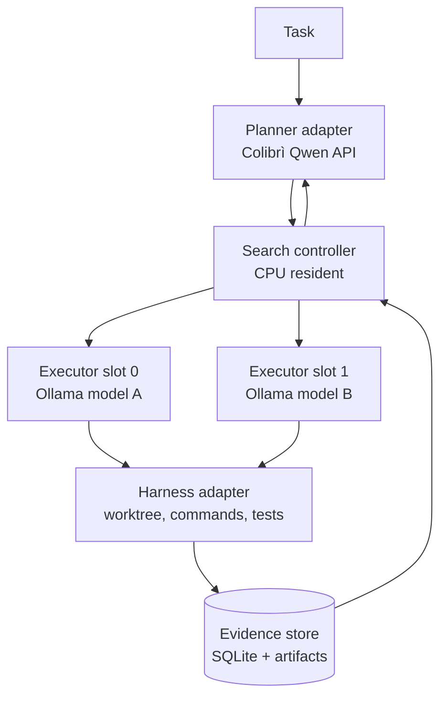
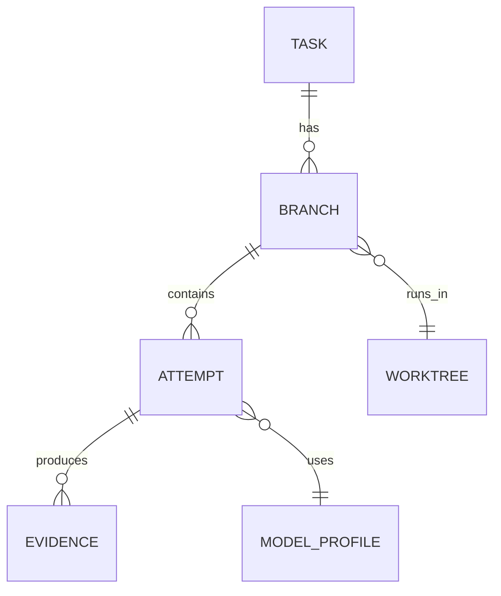

# Software-search swarm: constrained Stage-0 architecture

Status: Stage 0 implemented and capacity-probed. Executor dispatch remains
intentionally disabled.

## Requirements and hard constraints

- Solve software-engineering tasks through evidence-producing search branches,
  not a chatty generic swarm.
- Use Qwen3.6-35B-A3B through the local Colibrì API as a strategic planner.
- Use heterogeneous Ollama executors, with isolated Git worktrees and bounded
  shell/test permissions.
- Keep the controller, evidence, and model endpoints private to the server.
- Compare strategies using fixed task and GPU-minute budgets.
- Current physical limit: two PCIe P40s, 24 GiB each. At the 2026-09-11
  capacity probe, the thermal supervisor had Qwen stopped and both cards were
  empty (35 C / 37 C). This is a safe benchmark state, not evidence that Qwen
  and an executor fit concurrently.

The current Ollama endpoint is `http://172.17.0.1:11434`; it is healthy and
now has a single small executor candidate, `qwen3:8b`, alongside existing
27–35B models. It is not yet the admitted executor pool. Ollama itself
loads a model on one GPU when it fits there, otherwise spreads it across GPUs;
parallel requests expand context memory. See the
[Ollama FAQ](https://docs.ollama.com/faq). This makes a five-concurrent-model
design physically false on the present box.

## Decision

Build a CPU-resident modular controller with **two physical executor slots**,
not a five-agent resident swarm. A search episode may create four logical
branches, but schedules them in two waves. Qwen plans at episode boundaries;
it is not held in the critical path of every executor action.

Initially retain the Qwen service and test whether one small executor can fit
in the unused VRAM on each P40 at a 4K context cap. If that fails or reduces
planner reliability, use an explicit phase schedule: planner checkpoint → stop
or quiesce planner → two executor waves → restart planner → evidence review.
Do not let Ollama implicitly split a model across both P40s.

## Modules and data ownership

| Module | Owns | Does not own |
| --- | --- | --- |
| Controller | task budget, branch state, allocation decisions | model execution or repository files |
| Planner adapter | prompt/response transcript, planning schema validation | command execution |
| Executor adapter | request/response transcript and model identity | branch score |
| Harness adapter | worktree lifecycle, allowlisted commands, artifact capture | planner policy |
| Evaluator | normalized test/benchmark/static-analysis evidence | model prose as ground truth |
| Evidence store | immutable run/event records | mutable working tree content |

`Evidence` is append-only and records command, exit status, duration, stdout
digest, test/benchmark metrics, changed-file digest, and artifact paths. A
branch cannot self-promote; the evaluator computes its score from evidence.

## Minimal API contracts

`POST /v1/tasks` creates a task with a Git revision, a budget, acceptance
tests, and a maximum branch count. `POST /v1/tasks/{id}/plan` asks the planner
for structured hypotheses. `POST /v1/branches/{id}/run` dispatches exactly one
bounded executor attempt. `GET /v1/tasks/{id}/evidence` returns immutable
evidence; `POST /v1/branches/{id}/promote` requires evaluator gates. All
commands run from an allowlist in a per-branch worktree; no executor receives
ambient SSH credentials, production paths, or destructive permissions.

## First model pool and why it is deliberately small

Stage 1 begins with `qwen3:8b` at a 4K context and one request. Do not pull
the other candidates until the first candidate's fit, thermal, and executor
quality evidence is recorded:

| Role | Candidate | Download size | Purpose |
| --- | --- | ---: | --- |
| General implementer | `qwen3:8b` | 5.2 GB Q4_K_M | rate + schema-plan gates pass; task gate pending |
| Independent critic | `gemma3:12b` | 8.1 GB | different family; review and synthesis |
| Code alternative | `deepseek-coder:6.7b` | 3.8 GB | independent code-oriented branch |

Sizes are current Ollama library listings, not allocated VRAM. Qwen3:8B is
available with tools/thinking; Gemma 3 provides a separate model family; and
DeepSeek Coder supplies a code-specialized comparison. References:
[Qwen3](https://ollama.com/library/qwen3%3A8b),
[Gemma 3](https://ollama.com/library/gemma3), and
[DeepSeek Coder](https://ollama.com/library/deepseek-coder).

Use `OLLAMA_NUM_PARALLEL=1` and small context caps. The measured executor
topology is two **independent**, loopback-only Ollama processes, one per P40;
not two models delegated by a single scheduler. Each worker requires a
physical-GPU `CUDA_VISIBLE_DEVICES` value and `OLLAMA_LLM_LIBRARY=cuda_v12`.
Without the backend override, the host's Vulkan discovery can select the wrong
physical P40 despite CUDA visibility filtering. Each candidate must pass a fit
test, a fixed rate test, a tool-schema compliance test, and three small
repository tasks before it is admitted to the pool.

The two-worker warm control held 5,713 MiB per card and measured 43.73 / 44.09
individual decode tok/s, or 87.46 aggregate decode tok/s. This gives two real
physical executor slots for the first search waves. It does **not** imply that
both workers can coexist with the two-GPU Qwen planner. Use the explicit phase
schedule: planner checkpoint → stop Qwen → executor wave → stop workers →
planner review.

## Experiment sequence

1. **S0 capacity:** measure each candidate alone and alongside the resident
   planner. Record VRAM, tok/s, TTFT, temperature, and whether Ollama places it
   on the intended single P40.
2. **S1 executor quality:** fixed corpus of small bugs, tests, and benchmark
   tasks; same harness and per-branch time budget for every candidate.
3. **S2 diversity:** compare two same-model branches against two different
   model/role branches. Score overlap of changed files, hypotheses, and failure
   modes, not prose similarity.
4. **S3 allocation:** four logical branches in two physical waves. Compare
   equal allocation against simple best-first allocation under identical GPU
   minutes and a pre-registered score.
5. **Stop gate:** stop if heterogeneous best-first does not beat a single
   planner-directed baseline by a pre-set margin on held-out tasks.

The first prototype does not implement MCTS, autonomous production writes,
or unrestricted Codex control. It is a bounded beam-search controller whose
value function is test, build, benchmark, and review evidence.

## Stage-0 implementation and admission gate

The initial controller is deliberately a record-and-evidence plane, not an
agent launcher. Its loopback-only API can create bounded tasks and branches,
append immutable evidence, return task state, and apply a gated promotion.
It returns a conflict for dispatch. This prevents a partially built controller
from acquiring shell, Git, SSH, or model authority by accident.

The fixed harness profiles are similarly narrow: `git diff --check` and a
Python unittest profile run inside a detached, per-branch Git worktree. The
controller never selects arbitrary shell text from a model response.

Stage-0 admission conditions:

1. capacity probe confirms two P40s, temperatures below the run ceiling, and
   an explicit Ollama inventory;
2. a candidate completes a deterministic, one-request, 4K-context benchmark
   with telemetry and observable GPU residency;
3. the model is unloaded and temperatures return to an idle-safe state;
4. the candidate then passes tool-schema and fixed repository-task gates
   before the executor adapter may dispatch it.

The live probe is recorded in
`research/results/raw/S0-capacity-20260911T051119Z.json`. The first stock
Ollama candidate run is recorded separately; it is a rate/fit observation,
not executor-quality acceptance.

## Pascal executor optimization boundary

Ollama 0.30.9 rejects its `cuda_v13` package for `sm_61` and loads its
`cuda_v12` backend. Its installed CUDA library exposes compute-type controls
but not the upstream runtime MMQ switch. Therefore a Pascal-optimized
llama.cpp fork is an isolated A/B candidate, not an Ollama setting.

Any fork test must use the exact `qwen3:8b` GGUF blob, same prompt/context,
one GPU, fixed completion cap, and the same telemetry contract. Build stock
and patched `sm_61` binaries separately; never run a fork setup script against
the production Ollama installation. Admit a sidecar only after a reproducible
rate improvement with no output-fidelity, fit, or thermal regression.

The first matched pair is complete: the archived Pascal patch produced 45.52
tok/s versus 45.40 tok/s stock with an identical 64-token output. Treat its
0.27% difference as noise. This closes the patch as an easy-win candidate; it
does not justify replacing Ollama or changing a production executor route.
