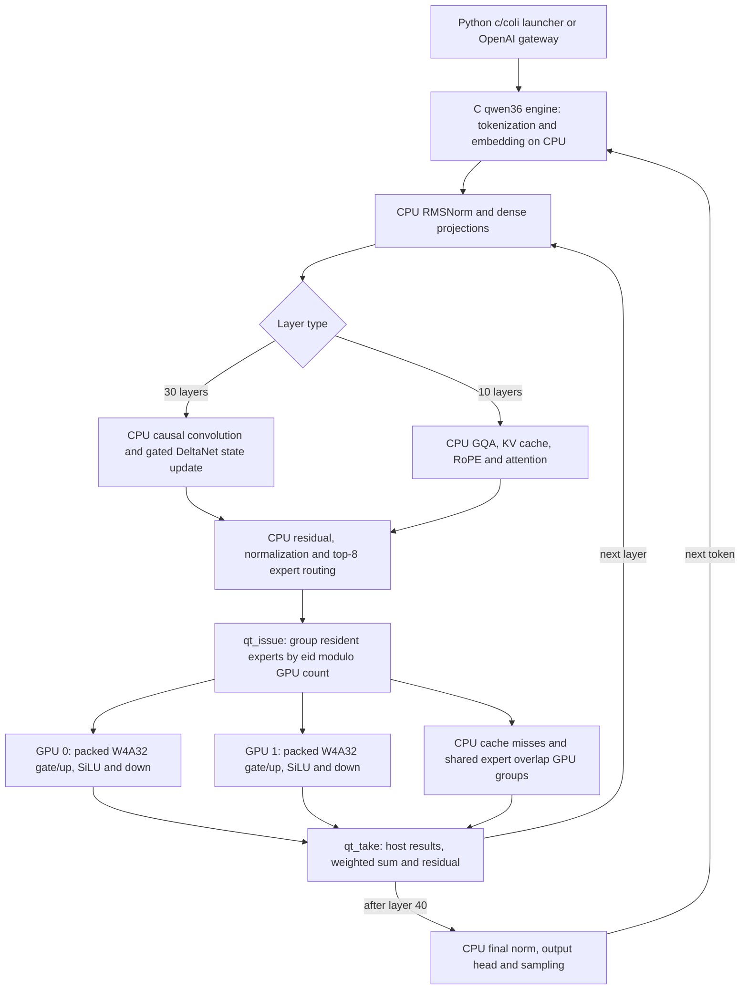

# Installed Colibrì: Qwen3.6 execution and settings

Evidence scope: clean remote source commit `12a5c464b5c1f8292d578c62458706bc32d6ac95`, version 1.10.1, inspected 2026-09-07. Source analysis describes the installed standard `qwen36` target, not every Colibrì family, optional segment adapter, or future upstream version. No inference trace was captured this turn.

## Actual pipeline

Weights in GPU memory do not put the residual stream or recurrent state there. The model itself is already a recurrent/attention hybrid: three DeltaNet layers for every attention layer. That makes its recurrence a useful empirical test bed for hardware-aware alternatives.

### Where the evidence lives

All source links below are pinned to the inspected commit.

| Claim | Installed source |
|---|---|
| Dense Q8-weight/FP32-activation computation uses CPU `matmul_d`, `matmul_q`, `matmul` | [qwen36.c, 993–1021](https://github.com/JustVugg/colibri/blob/12a5c464b5c1f8292d578c62458706bc32d6ac95/c/qwen36.c#L993) |
| CPU routing, GPU expert issue, CPU misses/shared overlap, host reduction | [qwen36.c, 1862–1989](https://github.com/JustVugg/colibri/blob/12a5c464b5c1f8292d578c62458706bc32d6ac95/c/qwen36.c#L1862) |
| CPU DeltaNet, normalization, residuals and head | [qwen36.c, 1993–2240](https://github.com/JustVugg/colibri/blob/12a5c464b5c1f8292d578c62458706bc32d6ac95/c/qwen36.c#L1993) |
| CUDA allocation requires full expert RAM slots; per-device budget | [qwen36_tier.c, 111–161](https://github.com/JustVugg/colibri/blob/12a5c464b5c1f8292d578c62458706bc32d6ac95/c/qwen36_tier.c#L111) |
| Expert home, activation replication and host sum | [qwen36_tier.c, 47–48 and 362–413](https://github.com/JustVugg/colibri/blob/12a5c464b5c1f8292d578c62458706bc32d6ac95/c/qwen36_tier.c#L362) |
| Packed nibble weights are unpacked to FP32 and multiplied with FP32 activations | [backend_cuda.cu, 798–843](https://github.com/JustVugg/colibri/blob/12a5c464b5c1f8292d578c62458706bc32d6ac95/c/backend_cuda.cu#L798) |
| Async expert dispatch: at most eight rows per device, one outstanding issue per device | [backend_cuda.cu, 2061–2182](https://github.com/JustVugg/colibri/blob/12a5c464b5c1f8292d578c62458706bc32d6ac95/c/backend_cuda.cu#L2061) |
| One KV slot and no tool API support for Qwen3.6 | [family_registry.py, 1046–1076](https://github.com/JustVugg/colibri/blob/12a5c464b5c1f8292d578c62458706bc32d6ac95/c/family_registry.py#L1046) |
| Request slot ignored; each request resets recurrent/KV state; serial serve loop | [qwen36.c, 2483–2607](https://github.com/JustVugg/colibri/blob/12a5c464b5c1f8292d578c62458706bc32d6ac95/c/qwen36.c#L2483) |
| Generic planner's model-size clamp and generic auto-tuning | [resource_plan.py, 775–814 and 939–989](https://github.com/JustVugg/colibri/blob/12a5c464b5c1f8292d578c62458706bc32d6ac95/c/resource_plan.py#L939) |
| Build links Qwen tier plus shared backend, not a generic full GPU engine | [Makefile, 1003–1023](https://github.com/JustVugg/colibri/blob/12a5c464b5c1f8292d578c62458706bc32d6ac95/c/Makefile#L1003) |

## Settings audit

`No call path` means not read by the inspected Qwen3.6 engine/tier or reached backend path. These flags can be meaningful for other families. Do not waste long A/B runs on them here; a static capability check should label them unsupported.

| Setting | Effect in this installed Qwen3.6 path | Benchmark action |
|---|---|---|
| `COLI_CUDA=1` | Enables expert tier if compiled with CUDA; `cap == n_experts` required | Control against CPU reference |
| `COLI_GPUS=0`, `1`, `0,1` | Tier consumes list; unset selects first two visible devices | One-GPU vs two-GPU after thermals |
| `COLI_GPU` | Not read by Qwen tier; launcher may translate CLI GPU choice to `COLI_GPUS` | Use plural explicitly; log child environment |
| `CUDA_VISIBLE_DEVICES` | CUDA runtime visibility and ordinal remapping | Keep fixed and record UUID-to-ordinal mapping |
| `CUDA_EXPERT_GB=auto` | Per selected device: currently free VRAM minus 1 GiB | Preferred starting control |
| Numeric `CUDA_EXPERT_GB` | Per-device GiB, not total. Manual number is not clamped at assignment to free VRAM; failed upload reduces future budget | Never run proposed 24/32 values as a total budget. Whole expert set already fits |
| `CUDA_DENSE=1` | No Qwen dense dispatch | New implementation required; first preserve existing Q8 weights and FP32 activations |
| `COLI_CUDA_ATTN=1` | No Qwen attention dispatch | Implement Qwen GQA/DeltaNet separately; generic latent-attention API is not an interchangeable layer |
| `COLI_CUDA_ATTN_SHARD=1` | No Qwen call path | Skip |
| `COLI_CUDA_PIPE=1/2`, pipe sharding/minimum | No Qwen residual GPU pipeline | Skip flag sweep; new device-state implementation needed |
| `CUDA_RELEASE_HOST=1` | No Qwen flag; warmstart already frees INT8 expert copies for GPU-planned slots | Keep packed host backing for fallback; inspect startup logs |
| `COLI_KEEP_INT8` | Presence retains those INT8 copies; even string `0` counts as present | Unset normally; reference-only A/B |
| `COLI_DENSE_I8` | On by default: CPU dense matrices quantized per row at startup | Pin on; zero for numerical reference only |
| `COLI_KEEP_F32` | Presence retains original dense FP32 matrices | Reference-only; not needed for normal runs |
| `QWEN_DENSE_BATCH` | CPU dense prefill reuse across rows; no S=1 benefit | Separate prefill measurement; DeltaNet explicitly calls S=1 projections |
| `QWEN_SHARED_BATCH` | CPU shared expert prefill chunks; tier overlap path does not use batching | Test only applicable CPU path |
| `COLI_CUDA_W4_PACKED` | Reached async per-row INT4 expert kernels; defaults on | Useful exact control |
| `COLI_CUDA_DUAL_PROJ` | Reached fused gate/up + SiLU path; defaults on | Useful fused-vs-unfused control |
| `COLI_CUDA_ASYNC` | Read by separate synchronous group wrapper, not the Qwen issue/take function | Do not assume toggles Qwen overlap |
| `COLI_CUDA_PROFILE` | Timed events currently in separate group wrapper, not Qwen issue/take | Add scoped events to reached path |
| `COLI_CUDA_TC_W4A16` | Tensor-Core path requires newer GPU and is outside Qwen async route | Disabled on P40 |
| `COLI_CUDA_TC_INT4` | Tensor-Core algorithm; not DP4A | Disabled on P40 |
| `COLI_NUMA=1` | No read found in Qwen translation unit/tier/reached headers; generic planner emits it | Verify effective `numa_maps`; use actual numactl policies for comparisons |
| `numactl --interleave=all` | OS policy applies to allocations regardless of engine flag | Compare against NUMA0 local placement, with thread count fixed |
| `OMP_NUM_THREADS`, binding, wait policy | Real OpenMP controls; launcher supplies physical core count | Stage count 12 vs 24, then placement, then spin policy |
| `DRAFT`, `COLI_CUDA_MTP` | Qwen main/serve path has no MTP decode implementation | Skip; model config having an MTP layer is not runtime support |
| `Q36_MAXT` | Default 8192, hard ceiling 262144; caps served context | Pin small 4096/8192 context; actual request state also depends on prompt/output |
| `--kv-slots`, `COLI_KV_SLOTS` | Gateway validates Qwen maximum 1 | No 2/4/8/16 slot benchmark until state isolation exists |
| `--max-queue`, `--queue-timeout` | Real gateway admission; defaults 8 queued, 300 seconds | Queue tests are separate from batching tests |
| `COLI_TIMERS=1` | CPU phase timing and issue/CPU/take waits | Use, but overlaps/subsets must not be summed twice |
| `HEAT_FILE`, `QT_NO_WARMSTART` | Learned warm placement; disable warmstart only for deliberate cold tests | Freeze heat fixture per comparison |
| `PILOT`, `HOT`, `WIDE`, `SMOOTH`, `CONF_LIMIT`, `COLIBRI_RESIDENT` | CPU prefetch/cache/routing-history controls | Freeze; not first-round optimization axes |
| `N_NEW`, prompt/ref file, `NOSTREAM` | Direct mode fixed generation budget and output control | Use direct fixed-token performance baseline |

## Why 16.2 GB, precisely

Read-only safetensors header accounting across 41 shards found:

- Container files: 21,130,957,832 bytes.
- Routed expert tensor payload: 16,231,956,480 bytes = 16.232 GB = 15.117 GiB.
- Other tensor payload: 4,896,711,936 bytes; this is disk representation, not measured runtime RSS or GPU reservation.
- Experts: 40 layers × 256 = 10,240, each 1,585,152 bytes.
- Qwen tier estimates another 4,096 bytes allocation slack per expert: about 15.156 GiB total, or 7.578 GiB per GPU under a two-way split, before CUDA contexts/workspaces.

The generic planner computes `min(requested_vram, safe_vram, expert_bytes)`. Its 16.2 GB warning is therefore the model-size bound in this snapshot. The actual tier uses per-device GiB and a different reserve (1 GiB, versus the planner's 2 decimal GB per card). The saved [planner output](results/2026-09-07-planner.json) confirms the arithmetic. Its `requires_host_backing:false` and generic bottleneck/pipeline hints are not a faithful statement about Qwen's real host copies/execution path.

Do not try 20→24→32 as an aggregate-budget experiment. A single P40 should have enough space for this expert set by accounting; actual allocations and performance still need measurement. Additional VRAM becomes useful when dense tensors/state are implemented on device or for a larger model.

## Traffic and utilization hypotheses

At full residency, each layer currently transfers a FP32 hidden vector once per selected expert and returns a vector per expert. With D=2048, K=8 and 40 layers, activation payload is `2 × 4 × 2048 × 8 × 40 = 5,242,880 bytes` (5 MiB) per token, summed over devices. Group descriptors, uploads, driver transfers and fallback behavior add traffic. This is a source-derived payload estimate, not measured PCIe traffic.

The same token uses experts on both GPUs; it does not traverse a GPU-to-GPU residual pipeline. Each device gets host activations, does local expert work and returns host results. Both can execute asynchronously, but only between CPU-controlled layer boundaries. At 1.5 tok/s the estimated activation payload is only 7.5 MiB/s: bulk PCIe bandwidth alone is an implausible explanation for the reported speed. Frequent small copies, synchronization, CPU stages and launch/reduction cost remain plausible. `nvidia-smi` utilization is sampled kernel-active time, not percentage of peak FLOPS or SM occupancy.

Per token the routed expert weight payload is approximately 507 MB before caching/reuse. The CPU Q8 output head alone is `248320 × 2048 = 508,559,360` weight bytes plus scales. Measure that stage before spending weeks optimizing expert arithmetic. Existing timers separate DeltaNet, attention, MoE, shared/router subsets, head, and issue/CPU/take waits; their counters need careful interval interpretation.

## Serving and Kimi boundary

Qwen's persistent server shares one model and expert tier, but resets the single recurrent/KV state between serial requests. Serving has no reached MTP path, ignores the incoming slot field, and rejects tool-use parameters in the Python renderer. Supporting an agent swarm requires isolated DeltaNet state, conv rings, attention KV and sampler state, a fair scheduler, batched expert gathering, cancellation and a tool-call protocol. Setting `SERVE_BATCH=1` in the gateway does not implement those features.

Kimi is a separate engine, not a larger Qwen configuration. In this commit, [kimi_k3.c, 821–828 and 1563–1605](https://github.com/JustVugg/colibri/blob/12a5c464b5c1f8292d578c62458706bc32d6ac95/c/kimi_k3.c#L1563) opts into `K3_CUDA=1`, selects device 0, uploads MXFP4 expert matrices per call, and computes the nonlinear intermediate on the host. `K3_MMAP` disallows CUDA. Thus the proposed persistent multi-GPU hot tier is not already supplied by this K3 path. Do not assume Qwen optimizations automatically transfer.
